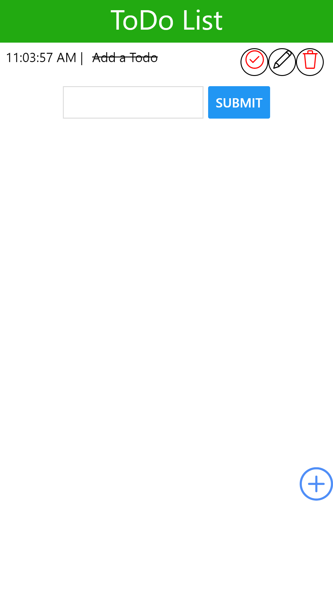
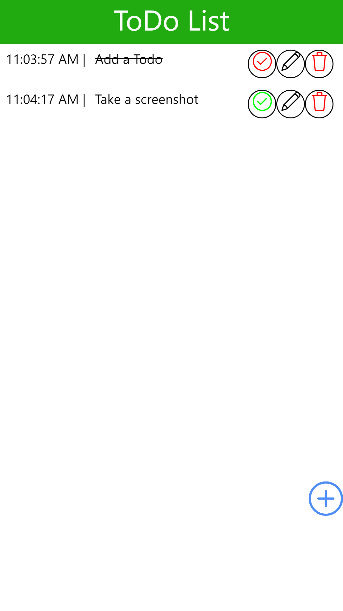
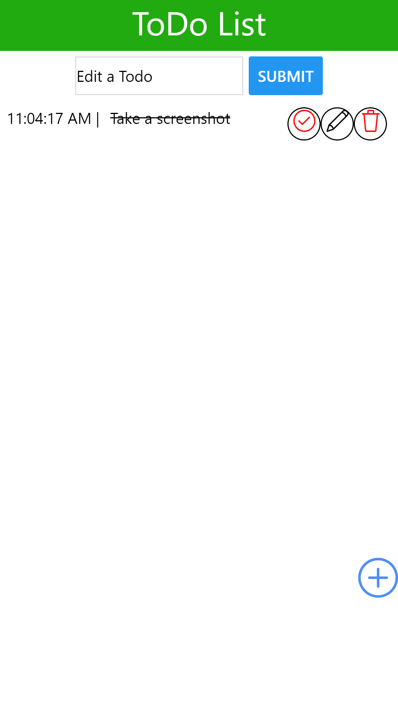

# React-native TODO list
## Description
A basic TODO app using react native  

## Table of Contents
1. [Installation](#Installation)
2. [Usage](#Usage)
3. [License](#License)
4. [Questions](#Questions)
## Screenshots

## Installation
Use expo-cli to build and run on mobile devices.

With node.js installed, forking the repo and using `npm install` should install all required packages
## Usage
Tap the plus button to add a new todo, tap the check mark to complete a todo, the trash can to remove it and the pencil to edit it.
## License
This project uses a MIT license.
## Questions
You can find my github account at
[Andrew836-dev](https://github.com/Andrew836-dev)  
Or you can email me andrew.aj.gray@gmail.com
